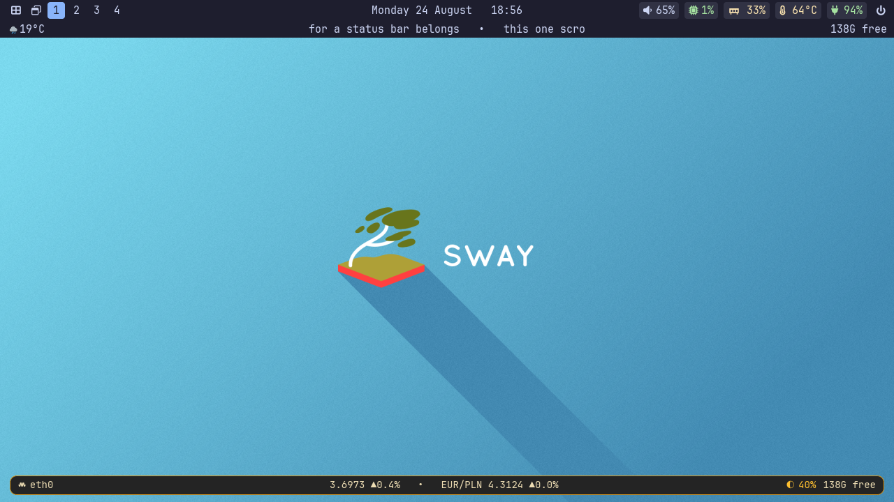
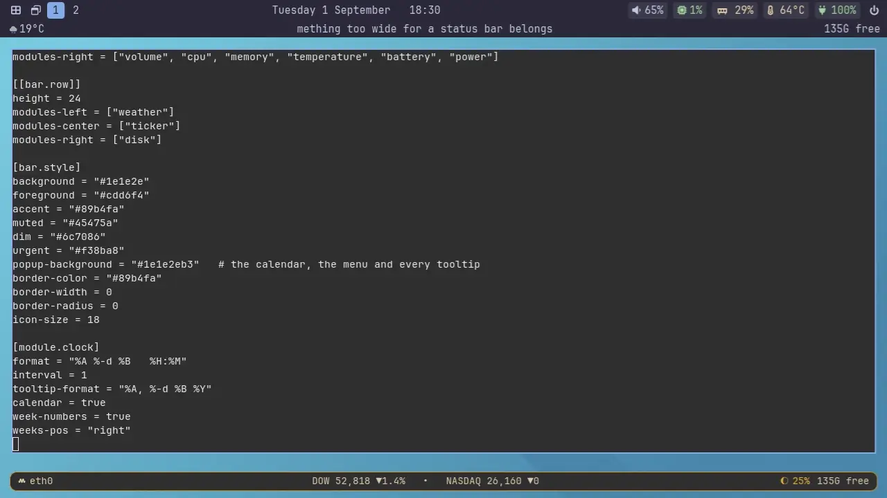
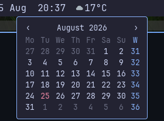
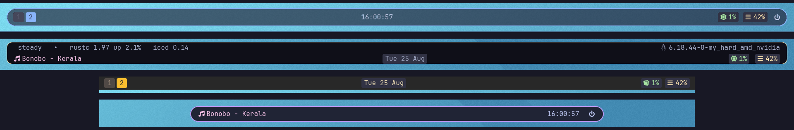

# ricebar

**A Wayland status bar you configure in one file.**
No stylesheet, no second language, no D-Bus. Built with [iced](https://iced.rs)
for Hyprland, sway, niri and anything else speaking `wlr-layer-shell`.



```toml
[bar]
modules-left = ["workspaces"]
modules-center = ["clock"]
modules-right = ["cpu", "battery"]

[bar.style]
background = "#1e1e2e"
accent = "#89b4fa"

[module.cpu]
format = "{icon} {value}"
colors = ["#a6e3a1", "#f9e2af", "#f38ba8"]   # green, amber, red by load
```

That is the whole idea. Colours, layout, modules and the commands behind them
live together in `~/.config/ricebar/config.toml`, and editing it updates the
running bar.



Two bars from two files — a two-row one at the top, a floating one at the
bottom — with the calendar, a power menu, a script-built popup and the
workspace buttons all clicked live. Recorded in a headless sway by
[`dev/record/record.sh`](dev/record/record.sh), so it is the same every time.

## Why another bar?

There are good bars for Wayland already. This one was written around a
particular set of wishes:

**One file, one language.** No CSS, no SCSS, no stylesheet to keep in step with
a config. Colours, layout, modules and the commands behind them sit together in
one TOML file.

**Edit it and see it.** Saving that file updates the running bar, so a colour
or a module is a change you make and look at, not a change you make and restart
for. A mistake in it leaves the running config alone and puts a warning in the
bar, rather than the bar disappearing on you.

Beyond those two:

- **Scripts are first-class, not an afterthought.** A module can be up to three
  scripts — one for what it shows, one for hover, one for a click — and a script
  can build a popup, stream its updates, or choose its own icon.
- **No D-Bus, no tray.** ricebar talks to a compositor socket and reads `/proc`.
  That is a deliberate limit, not a gap: see [what it does not do](#what-it-does-not-do).
- **Icons can be pictures.** svg, png or a font glyph, mixed freely, sized and
  coloured from config.
- **Vanilla iced 0.14**, not a fork of it.

## Features

**The bar**

- Top or bottom, any height, margins, border width, radius and per-module fills
- **As many bars as you like, from one file.** `[[bar]]` describes each one,
  with its own edge, size, palette, font and modules
- **A font per bar, and per module**, so one module can come from an icon family
  the rest of the bar does not use
- **A bar can name the monitor it belongs on**, so the workspaces go on the
  laptop and the ticker on the big screen
- **More than one row.** `[[bar.row]]` stacks lines, each with its own left,
  centre and right, and its own height
- **See-through tooltips, menus and popups.** One `popup-background` per bar,
  alpha included, over a bar that stays as solid as you like
- Multiple monitors, and hotplug: plug one in and every bar without an `output`
  appears on it
- Reserves its own space, so nothing renders underneath it

**Built in**

| module | what it does |
|---|---|
| `clock` | time in any `strftime` format, with a **click-through calendar** — month navigation, ISO week numbers, and a command per day |
| `workspaces` | clickable, live, on Hyprland, sway and niri |
| `keyboard` | the layout in use, shown as `PL`, and a click for the list of the rest |
| `cpu` `memory` | usage, with colour by level |
| `temperature` | from hwmon, preferring a named sensor over the ACPI zone |
| `battery` | charge level, and a plug when it is on mains |
| `backlight` | brightness, with the wheel to change it |
| `[[module.menu]]` | a label that opens a list of commands — a power menu in six lines |



The calendar is a real surface rather than a tooltip: click the clock and it
opens below the bar, with arrows to step through the months, today in the
`urgent` colour and ISO week numbers down the side. `on-click-day` runs a
command for whichever day you click, with `{}` replaced by the date. Hovering
the clock is separate and keeps its own `tooltip-format`, so a clock can have
either, both or neither.

<br clear="right">

**From scripts, with no Rust**

| feature | how |
|---|---|
| Any command as a module | `exec`, on an interval or `stream = true` |
| React the instant something happens | a streaming script blocks on `pactl subscribe` and prints; nothing polls |
| Hover text | `tooltip`, or `"tooltip"` in the script's JSON |
| Click actions | `on-click`; with a `label` and no `exec` that is a launcher button |
| Wheel actions | `on-scroll-up` / `on-scroll-down` |
| **Script-built popups** | `popup` prints a JSON list of labels and commands, drawn on its own layer surface |
| **A ticker** | `scroll-width` scrolls anything too wide for a bar past a fixed window |
| Icon by value | the script reports `percentage`, config maps it to an icon and a colour |
| Icon by name | the script returns `"icon"`, a glyph or a path, for icons that are not a level |

Examples ship with it and are written out on first run: volume, microphone,
Wi-Fi, Bluetooth, network, weather, a market ticker, and a window switcher that
works out the compositor for itself.

What a script needs is the script's own business, not the bar's. The Wi-Fi
display reads `ip` and `iw` and so is the same under any backend, while its
popup drives iwd through `iwctl` — on wpa_supplicant or NetworkManager, point
`popup` at a script of your own that prints the same JSON.

**Icons**

Anything in an `icons` list that looks like a path — it has a `/`, or starts
with `~` — is a picture. **svg**, **png** and **jpeg** all work, and one ramp
can mix them with glyphs:

```toml
[module.cpu]
icons = ["\uf2db", "~/.icons/candy/cpu-warm.svg", "/usr/share/pixmaps/hot.png"]
```

`[bar.style] icon-size` sizes them, and a module can override it. Colour
follows the freedesktop convention rather than another config key: an svg named
`*-symbolic.svg` is recoloured to follow the module's `colors`, so a memory
icon turns amber under load; anything else keeps the colours it was drawn with,
so a weather icon keeps its yellow sun.

## More than one bar



Four bars across two monitors, from one config file in one process. Top to
bottom: a floating translucent bar and a two-row dock on the first monitor, then
a square slab and a rounded pill on the second — each with its own edge, height,
palette, corner radius and border.

Every bar is a `[[bar]]` table. Module *definitions* stay global, and each bar
names the ones it wants:

```toml
[[bar]]
output = "eDP-1"                 # omit to appear on every monitor
position = "top"
height = 44
margin = [12, 16, 0, 16]         # the gap that makes it float
modules-left = ["workspaces"]
modules-right = ["cpu", "memory", "battery"]

[bar.style]
background = "#1e1e2ecc"         # the last two digits are alpha
popup-background = "#1e1e2eaa"   # tooltips, menus and popups; unset takes `background`
border-color = "#89b4fa"
border-width = 2
border-radius = 22

[[bar]]
output = "HDMI-A-1"
position = "bottom"
exclusive = false                # windows pass under this one
modules-center = ["stocks"]

[module.cpu]                     # defined once, drawn on whichever bars name it
colors = ["#a6e3a1", "#f9e2af", "#f38ba8"]
```

A module named by several bars is **built once and drawn several times**, so a
clock on three bars is one clock and a script on two bars is one process.

`output` takes the name the compositor uses — `hyprctl monitors`,
`swaymsg -t get_outputs` or `niri msg outputs` will tell you. A name matching no
monitor does not put that bar on some other one: it is left undrawn, and the
bars that could be placed carry a warning naming the monitors that do exist.
Undock a laptop and the bar meant for the external screen goes away rather than
piling on top of the built-in one. The exception is a config whose *only* bar
names a monitor that is not there — that one is drawn anyway, since a bar that
is both invisible and silent is indistinguishable from one that failed to start.

A single `[bar]` table still means one bar on every monitor, which is what the
first run writes and what most people want.

## Install

```sh
cargo install --git https://github.com/pawciobiel/ricebar
```

That puts `ricebar` in `~/.cargo/bin`. `cargo install --git … --force` updates
it later.

Or build it yourself:

```sh
git clone https://github.com/pawciobiel/ricebar
cd ricebar
cargo build --release
./target/release/ricebar
```

Not on crates.io: publishing there requires signing in through GitHub and
granting the account access it does not need. Installing from git needs no
account at all.

Needs `wayland-client`, `libxkbcommon`, and a Vulkan driver — iced falls back to
software rendering via `tiny-skia` if wgpu is unavailable.

Nothing else. The binary links against libc, libgcc and libxkbcommon, and opens
Wayland and Vulkan at runtime. There is no D-Bus, PulseAudio or PipeWire library
in it, because audio is not a built-in module: it is a script calling `pactl`,
which costs nothing on a machine that does not use it, and the first run leaves
it commented out where `pactl` is missing.

**The first run writes a config for you**, along with the example scripts and
icons it refers to, and says where they went. What it enables depends on the
machine: `PATH` decides whether the launcher and the volume module are on, and
an actual sensor read decides whether the battery is, so a desktop does not get
a battery module that can only ever fail. Anything left out is written commented
out with the reason beside it, which is also the instruction for turning it on:

```toml
modules-right = [
    "weather",
    # "volume",  # needs pactl
    "cpu",
]
```

Start it from your compositor's config:

```
# Hyprland
exec-once = ricebar

# sway
exec ricebar

# niri
spawn-at-startup "ricebar"
```

## Configuration

`$XDG_CONFIG_HOME/ricebar/config.toml`, or `~/.config/ricebar/config.toml`.
`-c <path>` reads another one instead, for running a second, separate ricebar —
several bars from the same file need no second process.

Every option is documented in [`config.example.toml`](config.example.toml).
A module runs only if it is named in a `modules-*` list, so deleting `"clock"`
from `modules-center` removes the clock.

A custom module is up to three scripts, any of which may be left out:

```toml
[[module.custom]]
name = "volume"
exec = "~/.config/ricebar/scripts/volume.sh"   # what it shows
stream = true                                   # kept running, one line per update
icons = ["\uf026", "\uf027", "\uf028"]        # chosen by the percentage it reports
format = "{icon} {value}"
tooltip = "Volume"                              # hover
on-click = "pavucontrol"                        # click
on-scroll-up = "pactl set-sink-volume @DEFAULT_SINK@ +5%"
```

### Reloading

Saving the config reloads the bar — modules, colours, formats, scripts, icons,
and the shape and placement of the bars themselves. Move a bar from the top to
the bottom, resize it, send it to another monitor, or turn one bar into three,
and it happens as you save. A layer surface is sized and placed once when it is
created, so ricebar builds new ones and drops the old.

One narrow case cannot: taking the last `font` key out of a config. A bar that
names no font falls back to the family iced was started with, and that one is
chosen once. Naming a font, changing it, or changing any size all reload, since
those are resolved every time a module is drawn.

A config that does not parse never reaches the bar. The running one keeps going,
the parser error goes to stderr naming the line, and a warning triangle appears
in the bar with the detail on hover — because a bar started by your compositor
has no terminal to print to, and saving a broken file would otherwise look like
nothing happening.

### When something breaks

A module that fails shows a warning triangle in the `urgent` colour with the
reason on hover, and the rest of the bar carries on. A command that does not
exist, exits non-zero, never returns, or prints malformed JSON all end up there
rather than taking the bar down or leaving a hole.

### Running commands

`[[module.custom]]`, `[[module.menu]]` and `on-click-day` all run shell
commands, so **the config file is the trust boundary**: anyone who can write it
can already run code as you. Validating the commands themselves would buy
nothing, since an attacker editing the file could name an allowed path just as
easily.

What ricebar does check is whether anyone *else* can write it — the same check
`ssh` and `sudo` make of theirs. If the config, or the directory holding it, is
group- or other-writable, the bar still starts and still draws, but runs no
commands and says so:

```
ricebar: ~/.config/ricebar/config.toml is writable by other users; refusing to run commands from it
ricebar: fix with `chmod go-w ~/.config/ricebar/config.toml`
```

Values substituted into a command — currently only `{}` in `on-click-day` — are
quoted for the shell first.

## Fonts and icons

ricebar runs with no particular font installed, but most icons it draws by
default are **Nerd Font** glyphs, and without one they render as empty boxes.
That is the first thing to check if the bar comes up looking broken.

Nerd Fonts patch icon sets into a font's Private Use Area. The built-in modules
draw from three of them:

| what | set |
|---|---|
| cpu, memory, battery, mains, the broken-module triangle | Font Awesome |
| temperature, the power menu's entries | Material Design Icons |
| the backlight ramp | Weather |

These are not emoji, so an emoji font supplies none of them.

Install any Nerd Font — JetBrainsMono, FiraCode, Hack and Iosevka all have
patched builds — and name it in config:

```toml
[bar]
font = "JetBrainsMono Nerd Font"
```

The name must be the family as **fontconfig** knows it, which is not always what
the download was called:

```sh
fc-list : family | grep -i nerd            # what is installed
fc-match "JetBrainsMono Nerd Font" family  # what that name resolves to
```

A name fontconfig does not recognise is substituted silently rather than
reported, so text in the wrong face is worth checking with `fc-match` before
suspecting ricebar.

**None of it is mandatory.** Every icon is config, so a plain-text bar needs no
special font at all — and pictures need none either:

```toml
[module.cpu]
format = "cpu {value}"                # no icon
icons = ["*", "**", "***"]            # or your own, lowest level first
```

Config files here write glyphs as TOML escapes — `"\uf2db"` rather than the
character itself — so they stay plain ASCII and survive an editor with no font
for them. Either form works, and it is why the examples above are readable
without one.

## What it does not do

Worth knowing before you switch:

- **No system tray**, and none planned. It is D-Bus (StatusNotifierItem plus
  DBusMenu), and ricebar deliberately does not speak D-Bus. If you rely on
  apps that close to a tray icon, waybar or ironbar will serve you better.
- **No media controls** or notification module, for the same reason.
- **No icon themes by name yet** — icons are paths. `icon-theme = "candy-icons"`
  is on the list.
- **Young.** Built over a few days and used daily by its author, which is not
  the same as being tested by anyone else.

[TODO.md](TODO.md) has the full list, with the reasoning behind each.

## Contributing

Issues and pull requests welcome — especially compositor backends, example
scripts, and reports from setups unlike the author's.

```sh
cargo test
cargo clippy --all-targets -- -D warnings
cargo fmt --check
```

`dev/` holds nested sway and niri sessions for working on backends without
leaving your own compositor, and `dev/record/` the whole recording rig behind
the animation above: a headless sway, two bar configs, a pointer that can be
driven from a script, and `record.sh` to run a take start to finish.

## License

MIT
